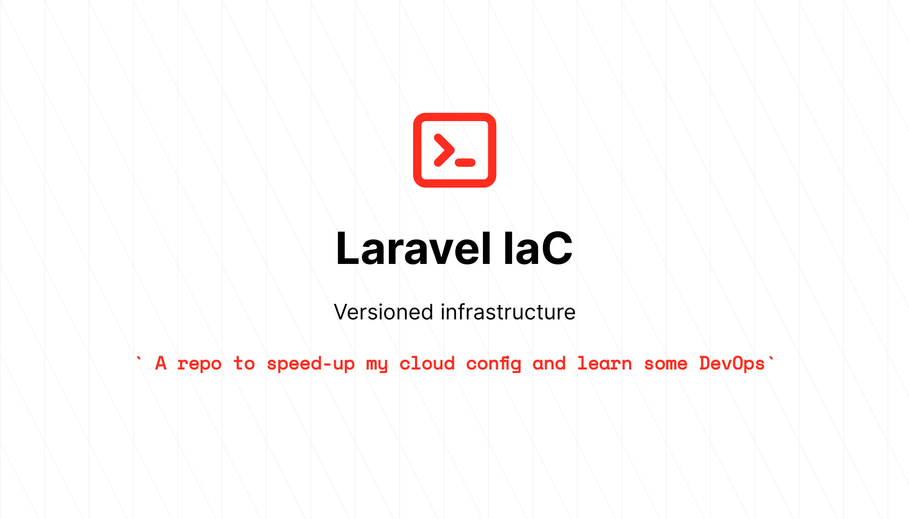

<div align="center">
	
</div>

It's always good to see something new in programming and even better if that "new" improves your work a little. For me, this is IaC. For those who don't know, IaC means *Infrastructure as code*. It's a way to program your infrastructure, versioning it on github and deploying it to a cloud service like Amazon, Digital Ocean or Azure ... as you probably do with web systems. Since I first met IaC, I have been fascinated and decided to learn at least some basic things about it. So, this repository is my experimental lab* and I'm still studying, but ... I thought it would be nice to share what I've learned so far. This is just the code you can play with, but I intend to write some articles explaining the magic behind this repo. For now, feel free to use and surprise yourself, as it happened to me.

##### * *Tested only in Debian based OS (like Linux Mint or Ubuntu) and WSL2*
______

This repository uses Terraform to provisioning resources and Ansible to configure the instances in the Digital Ocean cloud. These techs combined allow me to versioning my host infrastructure and build a server fully configured for Laravel apps with just a couple of terminal commands and no manual installations (after the prerequisites step, of course). The repo also allows me to create multiple droplets using the same command.

The droplets built with this repository will have the following software configuration:
  - PHP (selected version)
  - Postgresql 12
  - Composer
  - Node
  - NPM
  - Nginx

### Prerequisites:
To use this repo, It's important to install/configure these prerequisites, which will allow the scripts to do their "magic".

- Install: 
  - [Terraform](https://learn.hashicorp.com/tutorials/terraform/install-cli)
  - [Ansible](https://docs.ansible.com/ansible/latest/installation_guide/intro_installation.html#installing-ansible-on-ubuntu)
- Configure at Digital Ocean:
  - [Personal Access Token](https://www.digitalocean.com/docs/apis-clis/api/create-personal-access-token/)
  - [SSH key](https://www.digitalocean.com/docs/droplets/how-to/add-ssh-keys/to-account/)

### Usage:

#### Prepare the configuration
- After the install and configure the prerequisites, just give the *builder* script execution permission:
```bash
$ chmod +x builder 
```
- Create a `.env` based on .env.example file and fulfill the variables with the right value

#### View the plan
- To see the steps that terraform+ansible will follow to built the server, run the command:
```bash
$ ./builder plan
```

#### Build the server/servers
- Run the command to up the infrastructure + server:
```bash
$ ./builder up
```

#### Undo the infrastructure
- To undo the built infrastructure, simply run the command:
```bash
$ ./builder down
```

#### After the build
When the script finishes the build, you will see the droplet(s) info in your Digitalocean dashboard and in the final terminal output (just name and ip address here). You will also find a **admin** user in the instances, which is the `/var/www/html` owner along with the nginx and PHP config. This is to allows you to clone your repo and do your stuff without concerns about permissions and root usage.

### Environment Variables:

The repo uses some env vars to define aspects of the server that will be different on each situation, such as server name, hardware specs, php version and more. Only **TF_VAR_dotoken**,**TF_VAR_pvtkey** and **TF_VAR_pubkey** are mandatory. The meaning and the default value of each env var is described in `variables.tf` file.

#### Variables with predefined values

Some vars have predefined values and will break the build if something different is defined. The list of these variables and predefined values can be found below:

*TF_VAR_phpVersion*: accept only the version number of the PHP package. For now:
  - 7.4
  - 8.0

*TF_VAR_dropletRegion*: accept only the available Datacenter regions in the Digital Ocean repository, which is:

| **value** | **name**        |
|-----------|-----------------|
| nyc1      | New York 1      |
| sfo1      | San Francisco 1 |
| nyc2      | New York 2      |
| ams2      | Amsterdam 2     |
| sgp1      | Singapore 1     |
| lon1      | London 1        |
| nyc3      | New York 3      |
| ams3      | Amsterdam 3     |
| fra1      | Frankfurt 1     |
| tor1      | Toronto 1       |
| sfo2      | San Francisco 2 |
| blr1      | Bangalore 1     |
| sfo3      | San Francisco 3 |

*TF_VAR_dropletImageOS*: accept only the available OS images in the Digital Ocean repository, which is:
  
  - ubuntu-16-04-x32
  - ubuntu-20-04-x64
  - ubuntu-20-10-x64
  - debian-9-x64
  - debian-10-x64
  - freebsd-11-x64-zfs
  - freebsd-11-x64-ufs
  - freebsd-12-x64-zfs
  - freebsd-12-x64-ufs
  - centos-7-x64
  - centos-8-x64
  - fedora-32-x64
  - rancheros
  - fedora-33-x64

*TF_VAR_dropletHardwareConfig*: accept only the available specs for droplets in the Digital Ocean repository, according to the selected region:

| **value**    | **vCPUs** | **RAM (GB)** | **Disk (GB)** | **Price ($/month)** | **Type**         | **Available in**                                            |
|--------------|-----------|--------------|---------------|---------------------|------------------|-------------------------------------------------------------|
| s-1vcpu-1gb  | 1         | 1            | 25            | 5                   | basic            | ams2,ams3,blr1,fra1,lon1,nyc1,nyc2,nyc3,sfo1,sfo3,sgp1,tor1 |
| s-1vcpu-2gb  | 1         | 2            | 50            | 10                  | basic            | ams2,ams3,blr1,fra1,lon1,nyc1,nyc2,nyc3,sfo1,sfo3,sgp1,tor1 |
| s-2vcpu-2gb  | 2         | 2            | 60            | 15                  | basic            | ams2,ams3,blr1,fra1,lon1,nyc1,nyc2,nyc3,sfo1,sfo3,sgp1,tor1 |
| s-2vcpu-4gb  | 2         | 4            | 80            | 20                  | basic            | ams2,ams3,blr1,fra1,lon1,nyc1,nyc2,nyc3,sfo1,sfo3,sgp1,tor1 |
| s-4vcpu-8gb  | 4         | 8            | 160           | 40                  | basic            | ams2,ams3,blr1,fra1,lon1,nyc1,nyc2,nyc3,sfo1,sfo3,sgp1,tor1 |
| c-2          | 2         | 4            | 25            | 40                  | CPU Optimized    | ams3,blr1,fra1,lon1,nyc1,nyc3,sfo3,sgp1,tor1                |
| g-2vcpu-8gb  | 2         | 8            | 25            | 60                  | General          | ams3,fra1,lon1,nyc1,nyc3,sfo3,sgp1                          |
| gd-2vcpu-8gb | 2         | 8            | 50            | 65                  | General 2x SSD   | ams3,fra1,lon1,nyc1,nyc3,sfo3,sgp1                          |
| s-8vcpu-16gb | 8         | 16           | 320           | 80                  | basic            | ams2,ams3,blr1,fra1,lon1,nyc1,nyc2,nyc3,sfo1,sfo3,sgp1,tor1 |
| m-2vcpu-16gb | 2         | 16           | 50            | 80                  | Memory Optimized | ams3,blr1,lon1,nyc1,nyc3,sfo3,sgp1,tor1                     |


